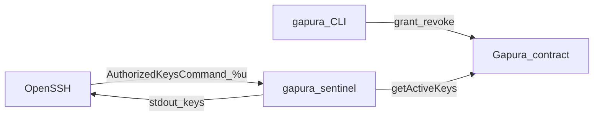

# Gapura — Daftar Kerja Pengembangan

Dokumen ini mendetailkan tugas implementasi [**Gapura**](PRD.md) (otoritas akses SSH terdesentralisasi via smart contract). Spesifikasi produk, user stories, dan arsitektur mengacu ke **[PRD.md](PRD.md)**.

**Stack:** Rust (CLI + Sentinel) + Solidity (Foundry), OpenSSH `AuthorizedKeysCommand`, jaringan L2 EVM (Base Sepolia / produksi nanti).

---

## Status baseline (snapshot repo)

- **`contracts/`**: [`Gapura.sol`](contracts/src/Gapura.sol) (MIT), tes [`Gapura.t.sol`](contracts/test/Gapura.t.sol), deploy [`Gapura.s.sol`](contracts/script/Gapura.s.sol). Template `Counter` tidak lagi dipakai.
- **`cli/`**: crate **`gapura`** — subcommand `init`, `grant`, `revoke`, `status`, `audit` ([`cli/src/main.rs`](cli/src/main.rs)); Alloy + config TOML.
- **`sentinel/`**: binary **`gapura-sentinel`** — Alloy, [`sentinel.toml`](docs/sentinel.md) + `users.toml`, cache in-memory (TTL 30s) + invalidasi periodik; **fallback cache disk** opsional (`cache_dir`); sanitasi stdout ([`sentinel/src/main.rs`](sentinel/src/main.rs)).

**Catatan kontrak vs PRD §5.A:** daftar key disimpan di storage **private** `_sshPublicKeys`; pembacaan eksternal melalui **`getActiveKeys`** dan **`keyCount`** (setara perilaku PRD, tanpa getter mapping Solidity per indeks).

**Catatan struktur:** `cli/`, `sentinel/`, `contracts/` tetap subtree terpisah. Satu **`Cargo.toml`** workspace di root (anggota `cli` + `sentinel`) opsional jika ingin `cargo build` tunggal dari root; tidak wajib.

---

## Arsitektur alur (referensi)

---

## Milestone M1 — Smart contract & Foundry

**Status:** selesai (kode + tes + skrip deploy + README env).

| # | Tugas | Selesai bila |
|---|--------|----------------|
| M1.1 | `Gapura.sol` sesuai PRD ( MIT, owner, isAllowed, events, grant/revoke/getActiveKeys, onlyOwner ) | `forge build` |
| M1.2 | `Gapura.t.sol` — unit/fuzz | `forge test` |
| M1.3 | `Gapura.s.sol` + `foundry.toml` Base Sepolia | Deploy dapat diulang |
| M1.4 | README deploy + `BASESCAN_API_KEY` | [`contracts/README.md`](contracts/README.md) |

---

## Milestone M2 — `gapura-sentinel` (Rust)

| # | Tugas | Status |
|---|--------|--------|
| M2.1 | Alloy + `getActiveKeys` | Selesai |
| M2.2 | argv `%u` | Selesai |
| M2.3 | `users.toml` | Selesai |
| M2.4 | Cache TTL ~30s + sweep 5 menit | Selesai |
| M2.5 | Sanitasi stdout | Selesai |
| M2.6 | Fallback cache JSON di disk + dokumentasi “enkripsi di lingkungan” | **Selesai** — lihat [`docs/sentinel.md`](docs/sentinel.md) (`cache_dir`, TTL fallback); enkripsi via disk/LUKS/ACL di luar proses |

---

## Milestone M3 — Integrasi SSH (uji lokal / VM)

| # | Tugas | Status |
|---|--------|--------|
| M3.1 | `sshd_config` | [`docs/sshd.md`](docs/sshd.md) |
| M3.2 | E2E grant → SSH OK → revoke → gagal | Checklist template [`docs/e2e-checklist.md`](docs/e2e-checklist.md); smoke lokal [`scripts/dev-smoke.sh`](scripts/dev-smoke.sh) (tanpa daemon SSH penuh) |

---

## Milestone M4 — CLI `gapura` (Rust)

**Status:** selesai — biner `gapura`, perintah PRD §5.C + `--config`.

---

## Milestone M5 — Opsional (PRD §8)

Dokumentasi terpusat: **[`docs/runbook.md`](docs/runbook.md)** (multi-node, monitoring ringkas).

- Emergency / break-glass: [`docs/sshd.md`](docs/sshd.md) §Emergency access.
- **Level 2** (challenge signature): masih future / out of scope v1.

---

## NFR & keamanan (ringkas)

Lihat PRD §6–7 dan [`docs/perf-notes.md`](docs/perf-notes.md) untuk satu pengukuran referensi (latensi / RSS).

---

## Di luar cakupan v1 (PRD §9)

- **PAM penuh** (v1 pakai `AuthorizedKeysCommand` dulu).
- **Account Abstraction / passkey login**.
- **Multi-signature admin**.
- **Windows OpenSSH** (v1 fokus Linux).

## Future / opsional

- **Level 2**: verifikasi tanda tangan wallet (challenge) untuk zero-trust lanjutan (PRD §8).
- **Rust workspace root**: satu `Cargo.toml` workspace untuk `cli` + `sentinel` itu **opsional** (quality-of-life untuk `cargo build` di root, tidak wajib untuk produksi).

---

## Checklist deliverable per area

- [x] **Contracts:** `Gapura.sol` (MIT), `Gapura.t.sol`, deploy script, env terdokumentasi
- [x] **Sentinel:** Alloy, `users.toml`, cache + opsi disk fallback, stdout aman
- [x] **CLI:** `init`, `grant`, `revoke`, `status`, `audit`
- [x] **Ops:** `sshd` docs, runbook, E2E checklist, smoke script, perf notes

---

*Terakhir diselaraskan dengan PRD Gapura dan kondisi repo.*
